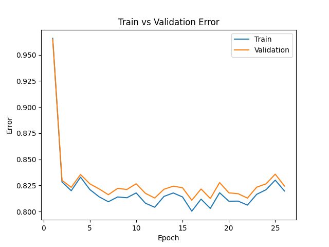
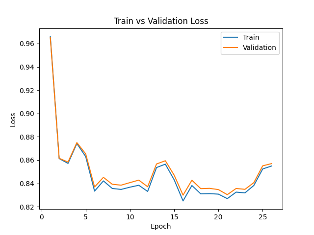
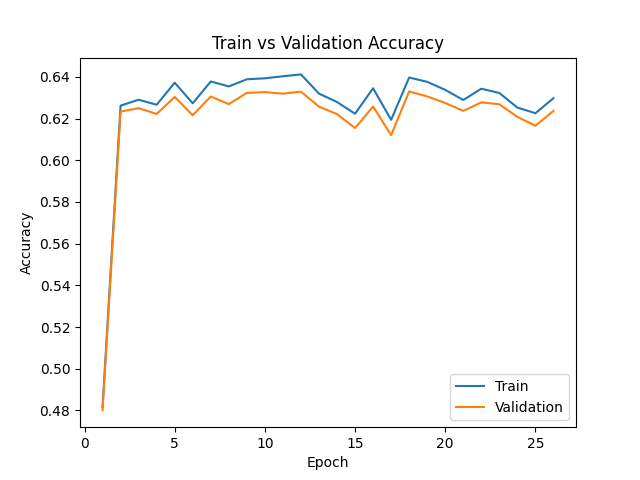

# To-Do
- Find a chess Engine that can be modified to give input to our neural net, and that can take its output.
- Export neural net to relevant format
- Find a visualization too of the network architecture for the progress report
- Solve issues


# Dataset
Install ztsd to unzip the dataset: 

https://github.com/facebook/zstd/releases

Download dataset into the dataset folder from: https://database.lichess.org/#variant_games

Unzip the dataset:
```bash
ztsd -d (filaname.pgn.zst) -o (filename.pgn)
```

Install python-chess:
```bash
pip install python-chess
```

The data can be read using utils/data_processing.py

# Neural net
See atomicdeep.py. Note that you need to install PyTorch with CUDA to run it optimally.

We are using the evaluation function on atomicdeep.py to evaluate the board from the current player's perspective.

The model is currently able to overfit on a small part of the dataset(3000 boards), but not on larger datasets (100 000 boards). Therefore we need a more complex neural net.

Latest test: ran on 1 000 000 boards from games where both players had elo greater than 1500, with 5000 games per file, batch size 1000, learning rate 0.01 and on 20 epochs. It took about 1h40mins to run the entire atomicdeep.py code.

|  |  |  |
|-----------------------------------------------------------------------------------------------------------------------|-------------------------------------------------------------------------------------------------------------------|-------------------------------------------------------------------------------------------------------------------|
<div id="b" align="center">
<h5>Metrics of latest test</h5>
</div>

## Installation

Install CUDA 11.7: https://developer.nvidia.com/cuda-11-7-0-download-archive

Download CUDNN for CUDA 11.7, extract it somewhere and add the bin folder to environment variables

Install PyTorch from: https://pytorch.org/get-started/locally/ (don't forget to select the right options)

## Ideas:
- Use 3D convolutions to capture the relationships between pieces
- Experiment with both 3x3 and 7x7 convolutions in the first layer to capture piece surroundings and long range relationships
- Use PyTorch's profiling option to see how the resources are used
- Try to run training on SSD instead of HDD

## Current issues:
- Getting the error, loss, accuracy on both validation and training takes more time than training itself. We can probably get the metrics for the training set inside of the training loop.
- Hardware use. Currently, during the training phase, only up to 3% of my GPU (nvidia gtx 1070) is used. Need to find a way to juice as much performance as possible out of it. There probably is a bottle neck somewhere in the code. Need better CPU or faster way of loading data into GPU.


# Engine
Engine allows user to play against the AI. It uses Monte Carlo Tree Search. For now, the engine  has a dummy evaluation function based on the material of the pieces, and uses random moves for the simulation.

To play, run engine.py and enter the moves using the algebraic notation. You can visualize the game in the board.svg file using your browser (keep refreshing).

Note that the engine is really bad.

TODO: checkout if the following engines can be used easily

https://github.com/fairy-stockfish/Fairy-Stockfish/wiki/Understanding-the-code. Here, need to modify this file:
https://github.com/fairy-stockfish/Fairy-Stockfish/blob/master/src/evaluate.cpp at line 1558.